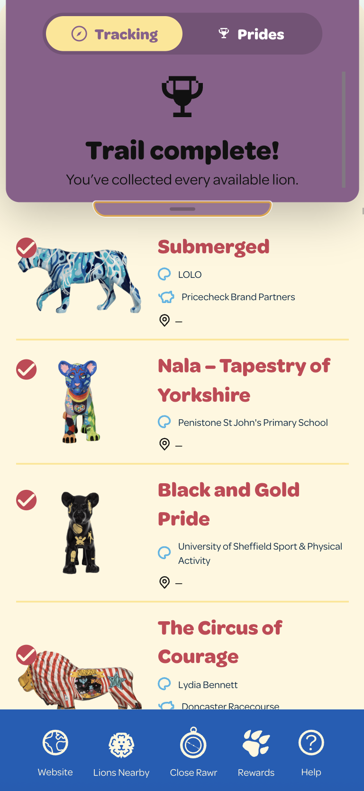

# PrideOfYorkshireUnlockTool
C# Based Console Application created to unlock all lions in the 2026 Pride Of Yorkshire Trail

## How It Works
* When the trail website loads it calls the API's `sync` endpoint. This exposes the IDs of the Lion scupltures
    - The unlock code (the 6 letter code printed on the base of each sculpture) is also returned in the `cheatCode` attribute, but that's not important right now
* When a user uses an unlock code, the website calls the API's `collections` endpoint. The payload contains a list of the sculpture IDs the user has found so far. This list is implicitly trusted by the API.
* Since there is an endpoint to retrieve both a list of all IDs **and** an endpoint to submit a list of all IDs a user has found so far, it is possible to manually create a payload to send to the `collections` endpoint which contains the ID of every sculpture

